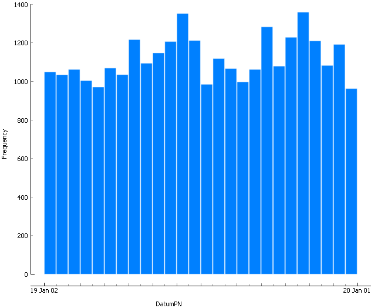
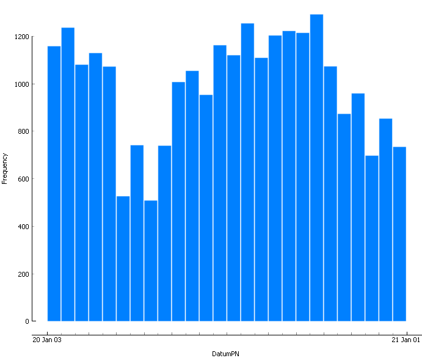
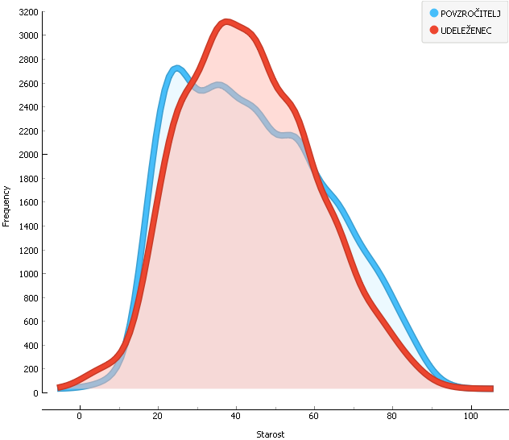

# Prometne nesreče v Sloveniji

PR21MV

## Avtor

Matej Vatovec

## Problem

Za seminarsko nalogo bom analiziral podatke o prometnih nesrečah v Sloveniji za leti 2019 in 2020. Podatke sem pridobil iz spletne strani policija.si (https://www.policija.si/o-slovenski-policiji/statistika/prometna-varnost).

## Opis podatkov

Podatki so podani v 2 datotekah tipa csv. Datoteki obsegata ena 33896 in druga 26074 vrstic, kjer vsaka vrstica predstavlja eno nesrečo. Atributi:

* Številka za štetje in ločevanje posamezne prometne nesreče,
* klasifikacija nesreče glede na posledice (Izračuna se avtomatično glede na najhujšo posledico pri udeležencih v prometni nesreči),
* upravna enota, na območju katere se je zgodila prometna nesreča,
* datum nesreče (format: dd.mm.llll),
* ura nesreče (format: hh) ,
* indikator ali se je nesreča zgodila v naselju (D) ali izven (N),
* lokacija nesreče,
* vrsta ceste ali naselja na kateri je prišlo do nesreče,
* oznaka ceste ali šifra naselja kjer je prišlo do nesreče,
* tekst ceste ali naselja, kjer je prišlo do nesreče,
* oznaka odseka ceste ali šifra ulice, kjer je prišlo do nesreče,
* tekst odseka ali ulice, kjer je prišlo do nesreče,
* točna stacionaža ali hišna številka, kjer je prišlo do nesreče,
* opis prizorišča nesreče,
* glavni vzrok nesreče,
* tip nesreče,
* vremenske okoliščine v času nesreče,
* stanje prometa v času nesreče,
* stanje vozišča v času nesreče,
* stanje površine vozišča v času nesreče,
* Geo Koordinata X (Gauß-Krüger-jev koordinatni sistem),
* Geo Koordinata Y (Gauß-Krüger-jev koordinatni sistem),
* številka za štetje in ločevanje oseb, udeleženih v prometnih nesrečah,
* kot kaj nastopa oseba v prometni nesreči,
* starost osebe (LL),
* spol,
* upravna enota stalnega prebivališča,
* državljanstvo osebe,
* poškodba osebe,
* vrsta udeleženca v prometu,
* ali je oseba uporabljala varnostni pas ali čelado (polje se interpretira v odvisnosti od vrste udeleženca) (Da/Ne),
* vozniški staž osebe za kategorijo, ki jo potrebuje glede na vrsto udeleženca v prometu (LL),
* vozniški staž osebe za kategorijo, ki jo potrebuje glede na vrsto udeleženca v prometu (MM),
* vrednost alkotesta za osebo, če je bil opravljen (n.nn v enoti mg alkohola/liter izdihanega zraka (mg/l)),
* vrednost strokovnega pregleda za osebo, če je bil odrejen in so rezultati že znani (n.nn v enoti g alkohola/kg krvi (g/kg)).

## Priprava podatkov

V obeh datotekah je nekaj mankojočih podatkov. Ker je podatkov veliko, sem se odločil, da vrstice z mankajočimi podatki odstranim. Podatki vsebujejo dva podobna atributa vrednost alkotest in vrednost strokovnega pregleda. Nekateri primeri imajo samo eno ali drugo mero, nekateri pa obe. Za lažjo analizo sem podatkom dodal še en atribut, ki vpošteva obe meri. To je stopnja vinjenosti [0-3]:

* 0: <0,3 g/kg ali 0,14 mg/l
* 1: 0,3 g/kg ali 0,14 mg/l < x < 0,5 g/kg ali 0,24 mg/l
* 2:  0,5 g/kg ali 0,24 mg/l < x < 0,8 g/kg ali 0,38 mg/l
* 3: >0,8 g/kg ali 0,38 mg/l

&nbsp;
Meje so postavljene na podlagi stopenj vpliva alkohola (https://www.avp-rs.si/preventiva/svetovalnica/vozniki/).

## Primerjava let

Kot lahko opazimo, je število nesreč v letu 2019 več. To lahko povežemo z zajezitvenimi ukrepi epidmije. Tej so nastopili ob prvem valu zacetek marca (13.3.2020 - 31.5.2020). Ob drugem valu pa oktobra in veljajo še zdaj (5.4.2020). Tem datumom ustrezajo tudi pomanšanja na grafu. Medtem pa je prvi graf dokaj uniformen. Vrhi so ob začetku poletnih počitnic in ob pričetku šol.

## Vozniki

Iz grafa lahko razberemo, da je največ povzročiteljev nesreč mladih voznikov (starih okoli 20 let). Kar lahko navežemo na njohovo neizkušenost v prometu. Medtem pa je porazdelitev udeležencev normalna, vrh pa dosegajo vozniki okoli 40-ga leta starosti.

